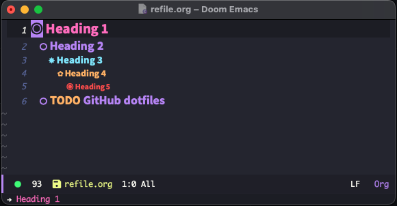
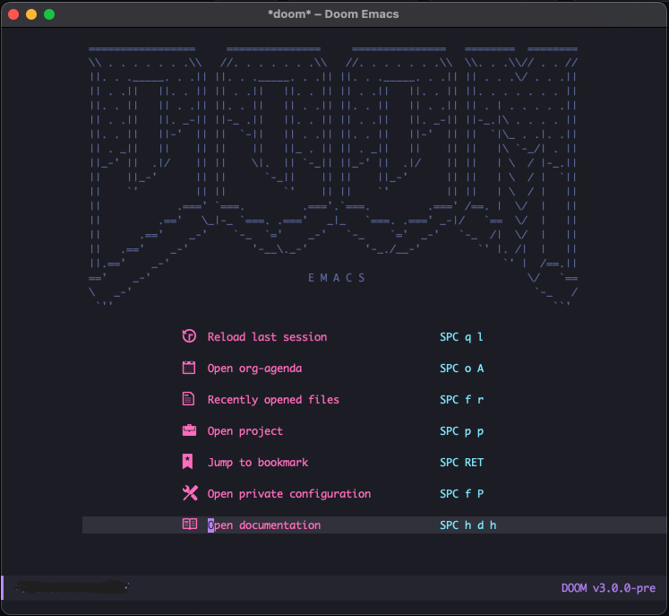

# Doom Emacs/Org Mode config
Implements <a href="https://github.com/dracula/dracula-theme" target="_blank">Dracula theme</a> and custom sizing/bullets for different heading levels in org mode.

   
   

